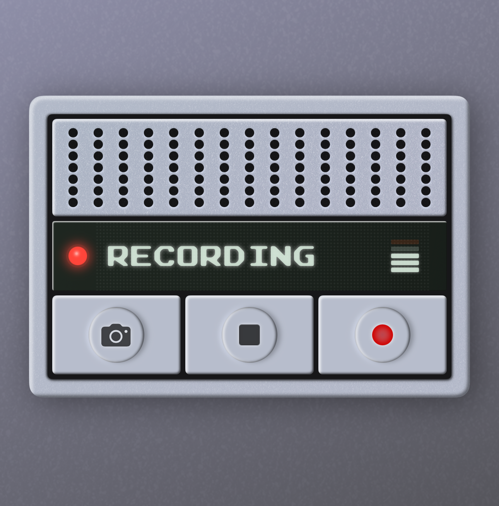

# Skeuomorphic / Realistic Audio Device

This is a SwiftUI implementation of a realistic-looking device with metal, rubber, and glass components. 
Intended for use in iOS apps. The device is completely functional.

Based on John Kantner's [original design](https://codepen.io/jkantner/pen/VwoaqoG) for web.

## Testing

Open in XCode and run the iOS previewer. No packages required.

Production note: I don't recommend copy-pasting into production as every shadow is rendered and the main thread absolutely takes a performance hit. It makes much more sense to use an image for anything static (eg the bulk of this device) and only use shadows where you need dynamic control.

## More by me

Check out [iain.website](https://iain.website).

## Contributing

Pull requests are welcome.

## License

[MIT](/LICENSE.txt)
